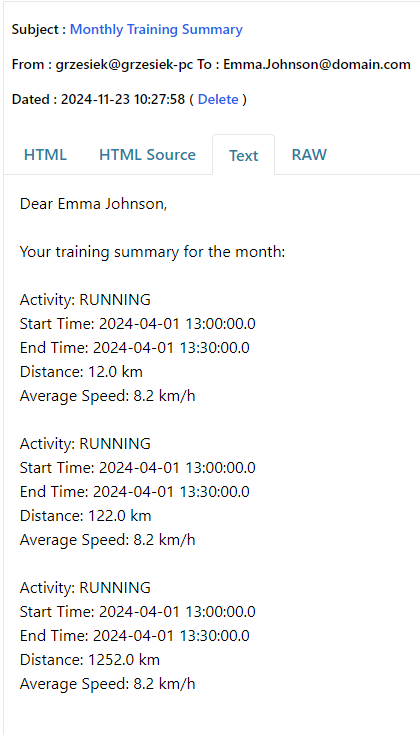
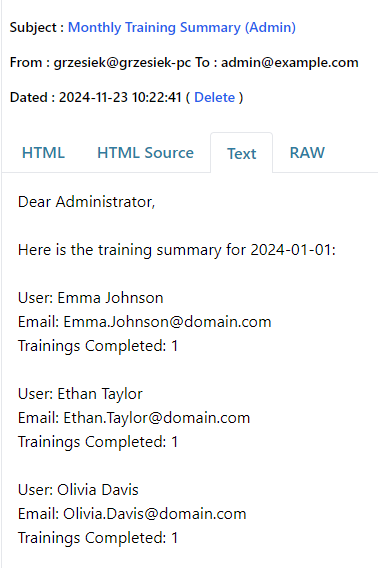

## Testing with Postman
Exported Postman collection can be found in [.json file](New%20Collection.postman_collection.json). It contains basic requests to already created API endpoints.

## Sending emails
Sending emails uses free SMTP server available at https://www.wpoven.com/tools/free-smtp-server-for-testing. Example outputs for running email endpoints looks like this:
1. Monthly email report to specified user
```
C:\Users\grzesiek>curl -X POST "http://localhost:9012/v1/emails/monthly-report/1?month=2024-01"
Monthly report sent to Emma.Johnson@domain.com
```

2. Monthly email report to app administrator
```
C:\Users\grzesiek>curl -X POST "http://localhost:9012/v1/emails/monthly-admin-report?adminEmail=admin@example.com&month=2024-01"
Admin monthly report sent to admin@example.com
```
